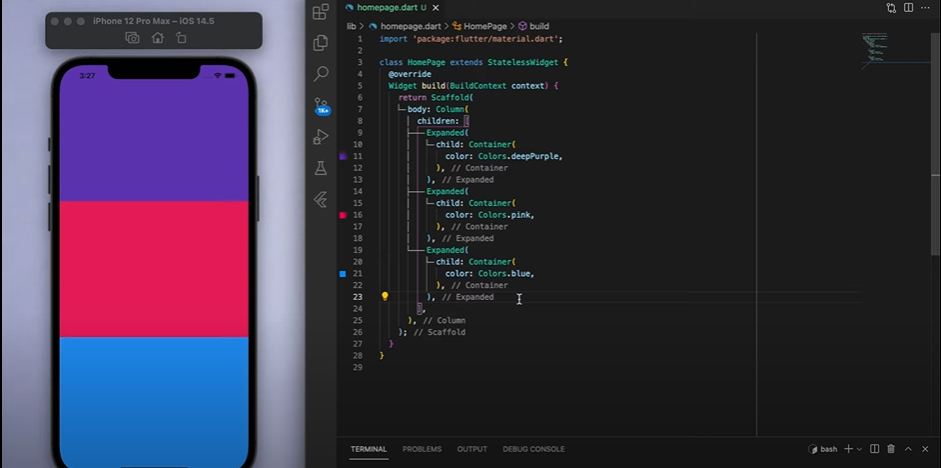

# Expanded  
- Fundamental Widget in Flutter 
- Should be placed inside either a Row or Column
- Take the screen space as per availible space 
- [Documentation](https://api.flutter.dev/flutter/widgets/Expanded-class.html)

